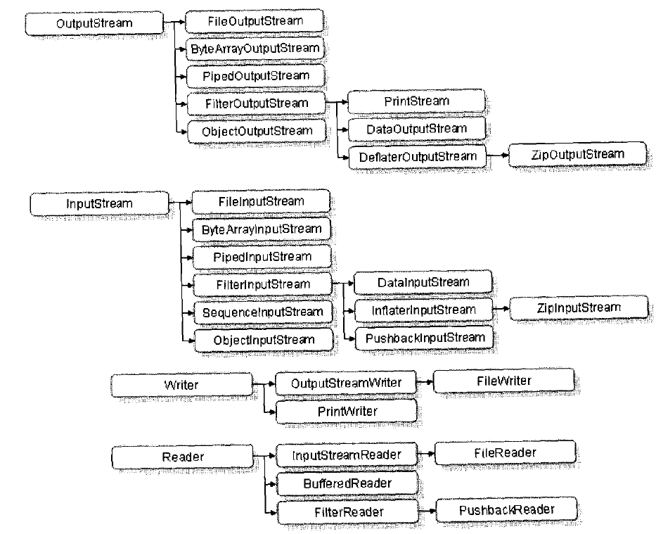

# Java IO

## 字节流与字符流
1. 使用File类打开一个文件
2. 通过字节流或者字符流的子类指定输出位置
3. 进行 读/写 操作
4. 关闭输入/输出流

* 字节流是直接操作文件的
* 字符流是操作 缓冲区 => 文件

## System对IO的支持
1. System.out.write()
2. System.err.println(); // 打印错误
3. System.in // 输入流
4. System.setOut(); // 重定向System.out的输出 ???
5. System.setErr(); // 重定向System.err的输出 ???

## 编码
* GBK/GB2312 ， GBK可以表示简体中文和繁体中文
* unicode Java中使用这种编码方式，是最标准的一种编码，十六进制表示,
* UTF  一种不定长的编码，兼容 ISO-8859-1编码,

# 总结
* IO操作类的关系图
