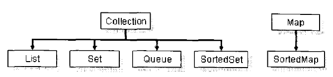

# Java 类集

## 常用类集
* Collection 是存放一组单值的最大接口
* List 是 Collection的子接口， 进行了扩充，内容允许重复
* Set 是Collection的子类，没有扩充，不允许存放重复值
* Map 是存放一对值的最大接口， 对值 => 键值对
* Iterator 集合的输出接口，用于输出集合中的内容，只能进行从前到后的单向输出
* ListIterator 是 Iterator的子接口，可以进行双向输出 
* Enumeration  用于输出指定集合中的内容
* SortedSet 单值的排序接口，实现此接口的集合类，里面的内容可以使用比较器排序
* SortedMap 存放键值对的排序接口，实现后，里面的内容可以按照 key排序，使用比较器排序
* Queue  对列接口，可以实现对列操作
* Map.Entry 是 Map.Entry的内部接口，每个 Map.Entry对象都保存这一对键值对的内容，每个Map接口中都保存有多个Map.Entry接口实例

关系如图

- 标识
* List可以存放重复内容
* Set 不能存放重复内容,所有重复的内容考 hashCode() 和 equals()方法区分
* Queue 对列接口
* SortedSet 可以对集合中的数据进行排序

 ## List
 add, add(index, object),remove(index),remove(object),isEmpty(),indexOf()
 ## Vector
 两者的区别：
 * ArrayList 采用异步处理，性能高， 但属于非线程安全, 只能用 Iterator, foreach输出
 * Vector 采用同步处理，性能较低，但线程安全， 可以用 Iterator，foreach，Enumeration输出
 * --一般用ArrayList--
 
 ## LinkedList 链表操作类
 
 ## TreeSet
 
 > 开发中，一个完整的类最好覆写Object的 hashCode(), equals(), toString()
 
 ## 集合的输出
 * Iterator  迭代输出， 最常用 (思维： 只要遇到了集合输出，就一定要用Iterator接口)
 * ListIterator    用于输出List中的内容
 * Enumeration    旧接口,和 Iterator类似
 * foreach   遍历
 
 ## Map  (存储 key => value 形式)
 * HashMap: 无序存放的，是新的类操作，key不允许重复
 * HashTable: 无序存放的，是旧的操作类， key不允许重复
 * TreeMap: 可以排序的Map集合，按集合中的key排序，key不允许重复
 * WeakHashMap: 弱引用的Map集合，当集合中的某些内容不再使用时清除掉无用的数据，使用gc进行回收
 * IdentityHashMap: key可以重复的Map集合
 
 
 <table class="table table-bordered table-striped table-condensed">
     <tr>
         <td>比较点</td>
 	     <td>HashMap</td>
 	     <td>Hashtable</td>
     </tr>
     <tr>
         <td>推出时间</td>
         <td>JDK 1.2后</td>
         <td>JDK 1.0推出</td>
     </tr>
     <tr>
         <td>性能</td>
         <td>异步处理，性能高</td>
         <td>采用同步处理方式，性能低</td>
     </tr>
     <tr>
         <td>线程安全</td>
         <td>非线程安全</td>
         <td>线程安全</td>
     </tr>
 </table>
 
 #### WeakHashMap
 * 从JDK 1.2 版本开始，Java把对象分为四种引用级别，从而使程序能够更加灵活地控制对象的生命周期，这四种由强到弱分别是： 强引用，软引用，弱引用和虚引用.
 * 强引用： 当内存不足时，JVM宁可出现 OutOfMemeryError错误而停止，也不会回收此对象来释放空间
 * 软引用： 当内存不足时，会回收这些对象的内存，用来实现内存的高速缓存
 * 弱引用： 无论内存是否紧张， 垃圾回收器发现立即回收
 * 虚引用： 和没有引用一样
 
 ## Map 接口注意事项：
 * 1 不能直接输出Map中的全部内容， 要分别输出 keys, 和 values (Map很少直接输出，大都作为查询使用)
 * 2  直接使用非系统类作为key (匿名的就会出问题)
 
## Identity HashMap 的 key可以重复，只要对象不是同一个

## Collections 包含多个处理集合的方法
* addAll(coll, obj, obj , ...) 添加多个对象
* reverse(coll); 反转序列
* replaceAll(coll, oldValue, newValue)； 用newValue替换oldValue
* sort(coll); 排序，前提是集合中元素实现了 Comparable接口
* swap(coll, index1, index2); 交换 index1 和 index2 位置的元素

## Stack 类
* empty() 测试栈是否为空
* peek() 查看栈顶
* pop() 出栈，并删除
* push(obj) 入栈

## 属性类  Properties
> ***.properties 这种文件叫做属性文件 ， 表现为 key=value对

